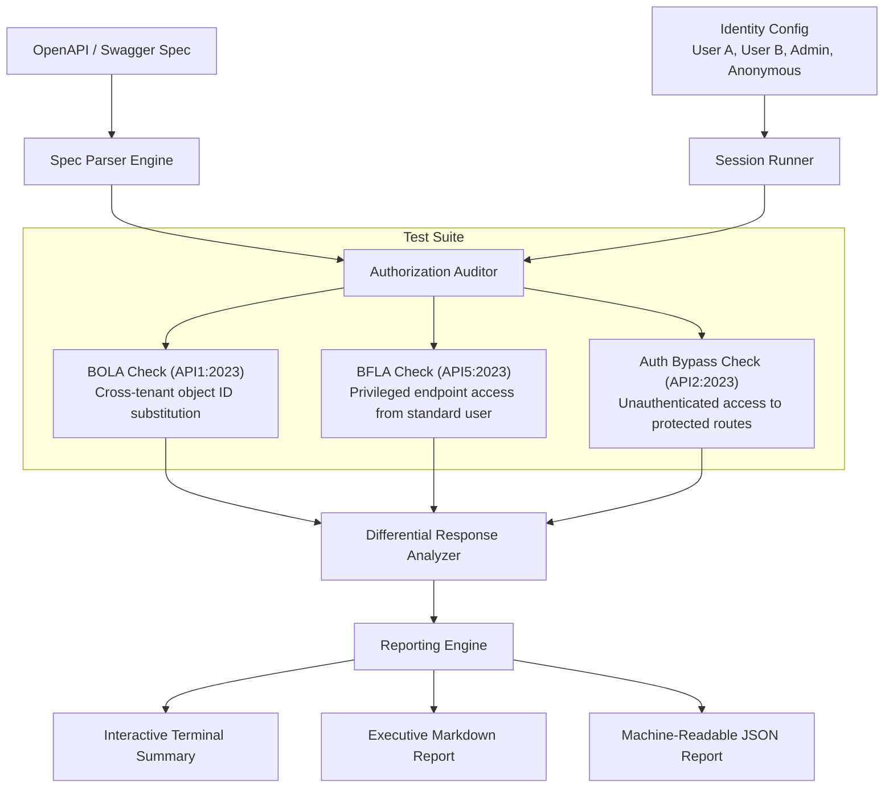

# AuthScope: Automated API Authorization & BOLA Testing Engine

[](https://python.org)
[](https://owasp.org/www-project-api-security/)
[](LICENSE)

An asynchronous dynamic security auditor designed to detect **Broken Object Level Authorization (BOLA / IDOR)** and **Broken Function Level Authorization (BFLA)** in modern REST APIs using OpenAPI specifications and multi-identity persona matrices.

---

## 📌 Why This Project Matters
Traditional dynamic application security testing (DAST) tools (such as standard crawling proxies) excel at finding syntactic injection flaws (SQLi, XSS), but they are fundamentally blind to **authorization and business logic flaws**. 

Detecting whether **Tenant B** can read or tamper with **Tenant A's** private documents requires:
1. Knowledge of API parameter schemas (path parameters like `{doc_id}` or `{order_id}`).
2. Multi-identity state management (concurrent sessions for distinct tenants).
3. Differential response analysis (evaluating status code variations and data isolation).

**AuthScope** solves this by automating multi-persona access control audits directly from an OpenAPI / Swagger specification.

---

## 🏛️ System Architecture



---

## ✨ Key Features
- **OpenAPI 3.0 & Swagger 2.0 Ingestion:** Automatically maps API endpoints, HTTP methods, and path parameter schemas.
- **Multi-Persona Session Matrix:** Simulates concurrent users with distinct authorization tokens, roles, and resource ownership mappings.
- **Automated BOLA Detection (OWASP API1:2023):** Performs automated object substitution (e.g., executing User B's token against User A's private resource IDs).
- **Automated BFLA Detection (OWASP API5:2023):** Flags administrative and sensitive maintenance routes accessible to non-admin roles.
- **Reproducible Evidence:** Generates developer-ready `cURL` commands for every identified vulnerability to accelerate remediation.
- **CI/CD Ready:** Exports reports in structured JSON and Markdown for automated pipeline security gating.
- **Bundled Vulnerable-by-Design Mock API:** Includes a complete multi-tenant mock microservice demonstrating both vulnerable and properly secured authorization patterns.

---

## 🚀 Quickstart Guide

### 1. Installation
Clone the repository and install the dependencies:
```bash
git clone https://github.com/your-username/authscope-api-auditor.git
cd authscope-api-auditor
pip install -r requirements.txt
```

### 2. Inspect an OpenAPI Specification
Analyze target endpoints and view identified test candidates:
```bash
python cli.py inspect-spec --spec mock_service/openapi.json
```

### 3. Run the Companion Mock Microservice
In a separate terminal, launch the local multi-tenant test server:
```bash
python cli.py start-mock --port 8000
```

### 4. Execute the Authorization Audit
Run the automated differential audit against the target API:
```bash
python cli.py audit --spec mock_service/openapi.json --config config.yaml
```

The tool will print an executive terminal report and generate both `AUDIT_REPORT.md` and `audit_report.json`.

---

## 🧪 Example Audit Output

```text
======================================================================
              AUTHSCOPE: API ACCESS CONTROL AUDIT REPORT
======================================================================
  Total Endpoints Scanned : 4
  Total Test Cases Ran    : 8
----------------------------------------------------------------------
  FINDINGS BREAKDOWN:
    - CRITICAL : 1
    - HIGH     : 1
    - MEDIUM   : 0
    - LOW      : 0
======================================================================

  IDENTIFIED ACCESS CONTROL VULNERABILITIES:

  [1] [CRITICAL] Broken Object Level Authorization (BOLA) in /api/v1/documents/{doc_id}
      Endpoint : GET /api/v1/documents/{doc_id}
      Standard : API1:2023 - Broken Object Level Authorization
      Details  : User 'User_B (Bob)' was able to access or modify resource {'doc_id': 'doc_101'} belonging to 'User_A (Alice)'. Server returned HTTP 200.
      Reproduce: curl -X GET http://127.0.0.1:8000/api/v1/documents/doc_101 -H 'Authorization: Bearer token-bob-456'

  [2] [HIGH] Broken Function Level Authorization on Admin Endpoint (/api/v1/admin/system-stats)
      Endpoint : GET /api/v1/admin/system-stats
      Standard : API5:2023 - Broken Function Level Authorization
      Details  : Standard user 'User_A (Alice)' successfully invoked administrative endpoint receiving HTTP 200.
      Reproduce: curl -X GET http://127.0.0.1:8000/api/v1/admin/system-stats -H 'Authorization: Bearer token-alice-123'
======================================================================
```

---

## 💼 How to Present This on Your Resume

Add this project under your **Projects** section with high-impact engineering bullet points:

```markdown
**AuthScope – Automated API Authorization & Access Control Auditor** | Python, AsyncIO, HTTPX, Pydantic
- Engineered an automated dynamic API security testing tool detecting Broken Object Level Authorization (OWASP API1:2023) and privilege escalation across multi-tenant environments.
- Implemented an OpenAPI 3.0 specification parser and an asynchronous differential HTTP execution engine simulating concurrent cross-tenant token swaps.
- Automated developer reproduction by synthesizing exact cURL repro commands and generating structured Markdown/JSON vulnerability reports for CI/CD integration.
- Developed a containerized multi-tenant test microservice with positive and negative access control testbeds, achieving 100% test coverage on baseline authorization assertions.
```

---

## 🛡️ License & Ethics
This tool is intended strictly for authorized security assessments, penetration testing within defined scopes of engagement, and developer defensive verification. Always obtain explicit permission before testing external endpoints.
